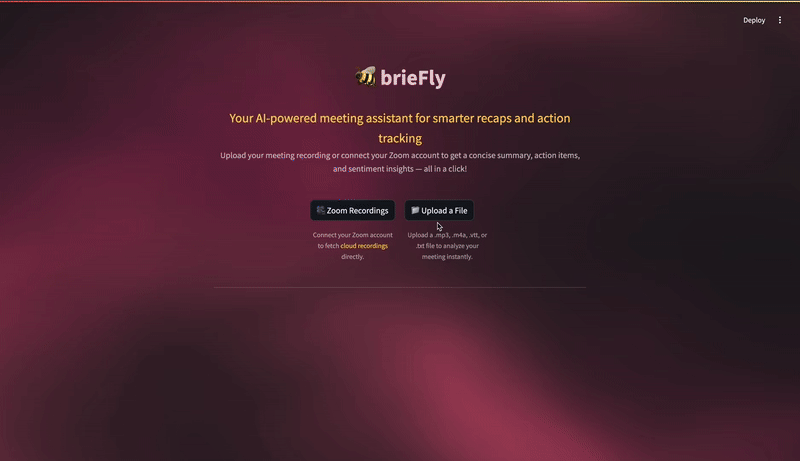

# 🐝 brieFly – Your AI Meeting Companion

brieFly is a GenAI-powered assistant that helps users **recap, analyze, and act** on their meetings. You can upload Zoom cloud recordings or recording files from your local system. It transcribes audio, summarizes key points, detects the emotional tone, and even provides actionable suggestions for team managers.

---

## 🚀 Features

- ➡️ **Zoom Integration**  
  Securely authenticate and fetch your **cloud recordings** directly via OAuth.

- ➡️ **File Upload**  
  Upload `.mp3`, `.m4a`, `.vtt`, or `.txt` files for transcription and analysis.

- ➡️ **AI-Powered Transcription**  
  Uses **OpenAI Whisper** to generate accurate meeting transcripts.

- ➡️ **Meeting Summarization & Action Items**  
  Extracts concise summaries and clear next steps using **GPT-4o**.

- ➡️ **Sentiment Analysis**  
  Detects the overall tone of the conversation using **RoBERTa** sentiment model.

- ➡️ **Contextual Suggestions for Managers**  
  Suggests actionable recommendations based on detected sentiment and transcript content.

---
## 📸 Demo


---

## 🧰 Tech Stack

| Tool / Library      | Purpose                                  |
|---------------------|-------------------------------------------|
| [Streamlit](https://streamlit.io/)           | Interactive frontend & UI rendering            |
| [OpenAI Whisper](https://platform.openai.com/docs/guides/speech-to-text) | Audio transcription                           |
| [OpenAI GPT-4o](https://platform.openai.com/docs/models/gpt-4o)        | Summarization & suggestion generation         |
| [Hugging Face Transformers](https://huggingface.co/docs/transformers) | Sentiment analysis (RoBERTa)                  |
| [Zoom API (OAuth)](https://marketplace.zoom.us/docs/api-reference/introduction/) | Meeting recording retrieval                    |
| Python, Requests     | API calls and file handling               |

---
## 🔐 Setup Instructions

#### 1. Clone the repo:
```bash
git clone https://github.com/yourusername/brieFly.git
cd brieFly
```

#### 2. Create & activate virtual environment:
```python -m venv venv
source venv/bin/activate  # macOS/Linux
venv\Scripts\activate     # Windows
```

#### 3. Install dependencies:
```pip install -r requirements.txt
```

#### 4. Add your .env file:
Create a .env file in the root directory with:
```OPENAI_API_KEY=your_openai_key
CLIENT_ID=your_zoom_client_id
CLIENT_SECRET=your_zoom_client_secret
REDIRECT_URI=http://localhost:8501
```

#### 5. Run the app:
```
streamlit run frontend/app.py
```

---
## 🙌 Acknowledgements
- [OpenAI](https://openai.com/) — for Whisper and GPT-4 APIs  
- [Hugging Face](https://huggingface.co/) — for the RoBERTa sentiment model  
- [Zoom API](https://marketplace.zoom.us/docs/api-reference/introduction/) — for accessing cloud recordings


---
## 📬 Connect

Made with ❤️ by [Karishma Hegde](https://www.linkedin.com/in/karishma-hegde/)

Feel free to ⭐️ the repo, or contribute!
